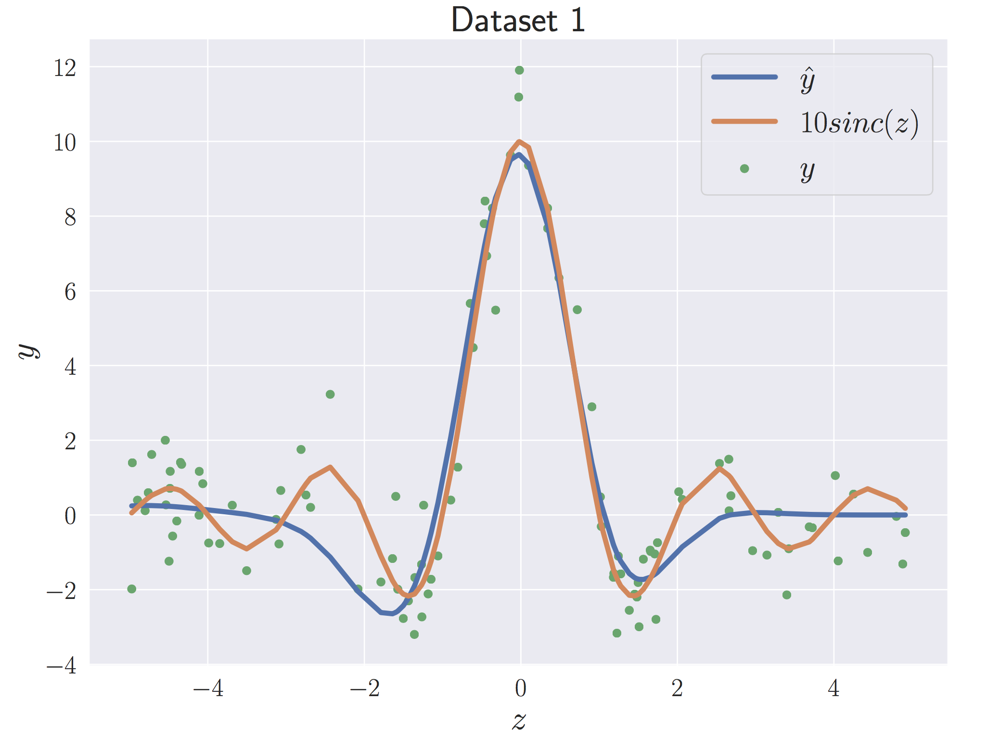
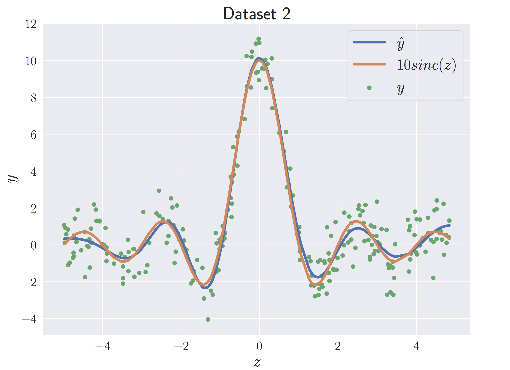
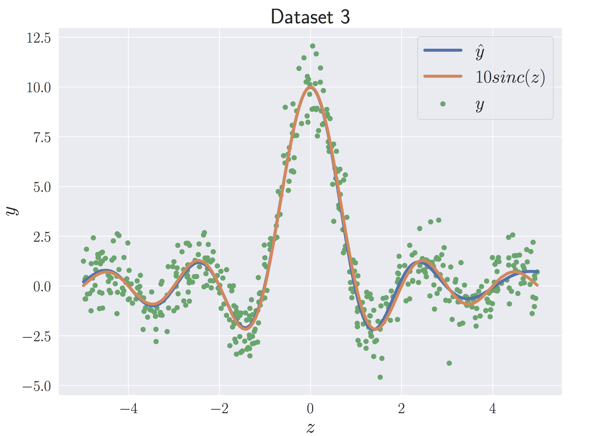

# bayesian_modeling
A collection of simple Bayesian machine learning methods implemented on toy data. 

- naive_bayes.py: an implementation of a simple probabilistic model for binary classification

- em.py: an implementation of the expectation-maximization algorithm for matrix factorization

- VI.py: an implementation of variational inference for regression

  
